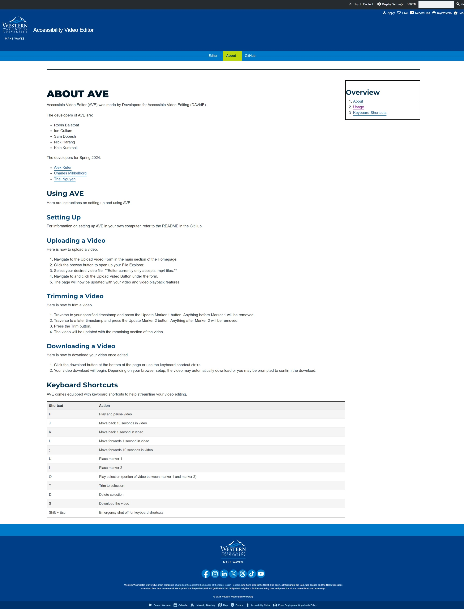

# Accessible Video Editor
## Jump to
* [Project Info](#project-info "Goto project-info")
* [R1 Contributions](#r1-contributions "Goto r1-contributions")
* [Installation Info](#installation-info "Goto installation-info")
* [UI Documentation](#ui-documentation "Goto ui-documentation")

## Project Info
### Course and Team
#### Course
CSCI 497T with Professor Elglaly

#### Team Members Spring 2024
- Thai Nguyen
- Alex Kefer
- Charles Mikkelborg

#### Previous Team Members
- Robin Balatbat
- Ian Cullum
- Sam Dobesh
- Nick Harang
- Kale Kurtzhall

## R1 Contributions
- Thai Nguyen
- Alex Kefer
- Charles Mikkelborg
    - Alerts
        - Added Timestamps to alert messages that display HH:MM:SS that an alert was posted.
        - A bulleted history of alerts displays instead of only a single alert message at a time. This list grows as more messages are added.
        - The session's alert history may now also be downloaded using the download history button, which downloads a text file with each message on it's own line.
    - Introduction
        - An introduction has now been added that provides helpful instructions to navigate and use the app.
    - Helped put together UI documentation

## Installation Info
### Dependencies
Requires Python 3 and Flask.

Install flask and Flask-Reuploaded with pip (or conda) in a virtual environment.
Note that for Conda, you will have to install pip to the Conda environment, and then call pip from the environments bin folder. The path to the folder `anaconda` may be different on your system, but it installs to your home directory by default.

#### Linux

##### Pip
```
python3 -m venv env
source env/bin/activate
pip install flask Flask-Reuploaded moviepy
```

##### Conda
```
conda create --name env
conda activate env
conda install pip
~/anaconda/envs/env/bin/pip install flask Flask-Reuploaded moviepy
```

#### Windows PowerShell
```
py -3 -m venv venv
venv\Scripts\activate
pip install flask Flask-Reuploaded moviepy
```

### Quick Start
The following scripts will run AVE locally on your computer in debug mode.

#### Bash Script
```
./run
```

#### CMD Script
```
./run.cmd
```

#### PowerShell Script
```
./run.ps1
```

### Live Test
This runs the app on port 8080 for external access. Intended for testing with remote participants

#### Bash Script
```
./run_live
```

#### CMD Script
```
./run_live.cmd
```

#### PowerShell Script
```
./run_live.ps1
```

### Clean
This script exists to clear out the upload folder.
```
./clean
```

#### Manually
Run each code line from the script associated with your terminal.
If your terminal scripting language is not supported you can do the following.
Create two environment variables, `FLASK_ENV` and `FLASK_APP`.
Set `FLASK_ENV` to `development` and `FLASK_APP` to `main`. 
Then start the website locally with `flask run`.

## UI Documentation

### Landing
ID: ave_landing


### About
ID: ave_about


### Upload
ID: ave_upload


### Editor
ID: ave_editor

